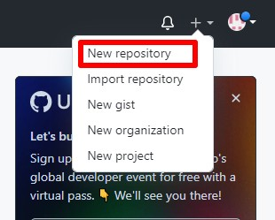

[<<к содержанию](./readme.md)

## Создание проекта на github.com

Для того чтобы загрузить проект на *GitHub*, нужно начать с репозитория. Репозиторий используют для организации одного проекта. В нём содержатся файлы с кодом, необходимые для разработки проекта. Есть приватные и публичные репозитории. К приватным можно подключить ограниченное число человек, публичные легко находятся в поиске другими пользователями.

Чтобы загрузить или создать репозиторий, воспользуйтесь выпадающим меню в правом верхнем углу на любой из страниц *GitHub* и выберите *New repository*.

В поле *Repository* name введите уникальное название. В учётной записи не может быть двух одинаковых. Можно добавить краткое описание. А далее выбрать, каким будет репозиторий: общедоступным или приватным.

