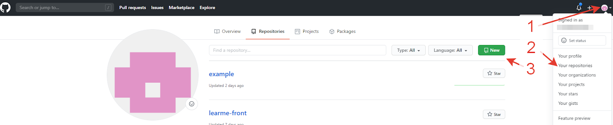

[<<к содержанию](./readme.md)

## Создание проекта на github.com
---
Для создания репозитория на *GitHub* используйте кнопку «new» на главной странице или на странице со списком репозиториев.

Создание репозитория на *GitHub* c главной страницы:

Создание репозитория на *GitHub* со страницы со списком репозиториев:

